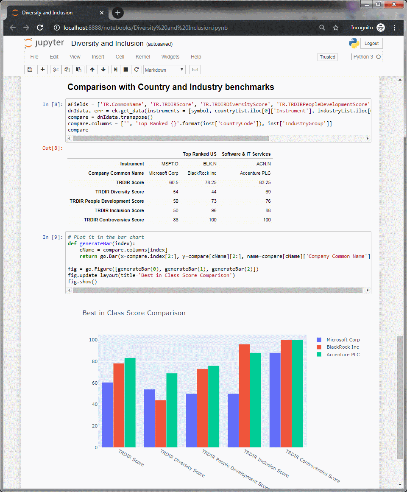

# Diversity And Inclusion
This Jupyter notebook demonstrates the use of ESG Diversity and Inclusion dataset within Eikon.

## Prequisites
* Running Eikon instance on the machine
* Access to Environment Social Governance dataset
* Python modules:
	+ Latest version of Eikon library
	+ Jupyter notebook
	+ Plotly graphs

## Output

Sample run from the notebook

